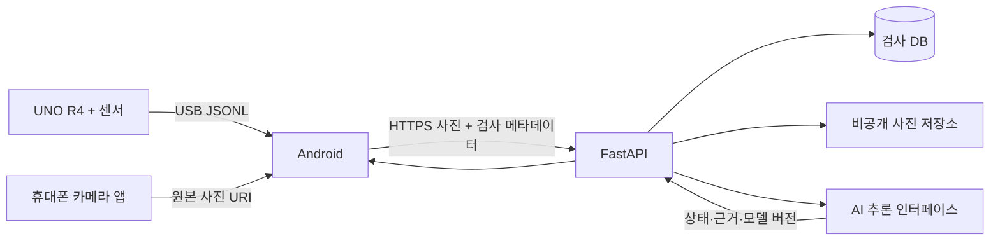

# 파일 위치와 연결 구조

```text
VisionMachine/
  .agents/rules/          Antigravity 프로젝트 규칙
  .github/               CI와 PR 양식
  prompts/               처음/파트별/통합/커밋 검토 프롬프트
  docs/                  합의·구조·역할·일정·검증 문서
  contracts/
    schemas/             Python 계약에서 생성한 JSON Schema
    examples/            합성 JSON 예제(실측 아님)
  packages/contracts/src/vm_contracts/
    models.py            계약의 원본: 검사·센서·분석결과
  server/
    src/vm_server/        HTTP API, 서비스, 저장소 구현 위치
    migrations/          DB 구조를 재현하는 SQL/마이그레이션
  apps/android/          Android 앱 생성 위치와 기능별 설계
  firmware/              UNO R4 실측 펌웨어 생성 위치와 시험 절차
  data-pipeline/src/vm_data/
    validate_manifest.py 자료 명세·그룹 누수 검사
  data/
    catalog/             공개자료 조사표(공개 가능한 정보)
    examples/            합성 메타데이터만
    templates/           자체 수집·라벨·교정 표 머리글
    raw/                 원본 사진·센서 로그(로컬 생성, Git 제외)
    interim/             정제 중간물(Git 제외)
    processed/           학습 입력(Git 제외)
    private/             정답·현장 정보(Git 제외)
    splits/private/      실제 train/val/test 파일(Git 제외)
  ml/src/vm_ml/           모델 인터페이스·학습·평가 코드 위치
  ml/configs/            재현 가능한 학습 설정(대상 확정 후 값 입력)
  ml/model_cards/        검증 범위·한계·모델 사용법
  scripts/               계약 재생성·로컬 검사
  tests/                 공통 계약·데이터 누수·API 시험
  storage/               실 DB·업로드 사진(로컬 생성, Git 제외)
  artifacts/             APK·모델·평가 상세 산출물(Git 제외)
```

빈 폴더를 만드는 대신 각 파트 README에 앞으로 만들 구체적 파일을 정의했다. 존재하지 않는 APK·모델·업로드 API를 만들어졌다고 표시하지 않는다.



계약을 변경하면 Python 원본·JSON Schema·예제·Android DTO·펌웨어 패킷·관련 테스트를 함께 갱신한다. 서버만 임의로 필드명을 바꾸지 않는다. 본 패키지는 v0.1.0 검토안이다.

원본 사진은 앱 내부 저장소→서버 비공개 파일 저장소로 이동한다. 데이터 파트는 허가된 스냅샷을 추출하여 별도 정제·분할한다. 서비스 DB와 학습 데이터셋을 같은 파일로 취급하지 않는다. 사진 삭제/보존/학습 사용은 별도 정책이 필요하다.
