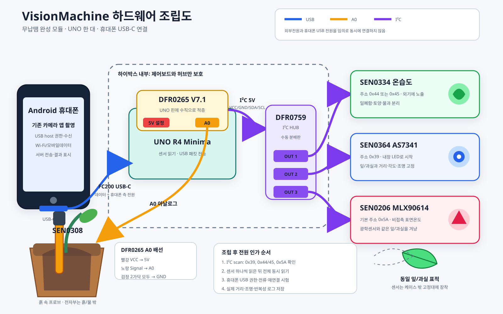

# 한 대의 UNO에 연결하는 센서 구성

검토 기준: 2026-09-19 제조사 문서. 아래는 전압·주소·단자 규격상 가능한 배선이며 실물 조립, 휴대폰 USB 전원/통신 시험, 작물 진단 유효성 검증을 대신하지 않는다.

연결을 한 장에 몰아보지 않도록 아래 그림도 함께 사용한다.

- [전체 구성도 PNG](assets/hardware-01-overall.png)
- [핀·포트 연결도](assets/hardware-pin-map.svg) / [PNG](assets/hardware-02-pin-map.png)
- [실제 화분 주변 배치도](assets/hardware-physical-placement.svg) / [PNG](assets/hardware-03-physical-placement.png)
- [조립·검사 순서](assets/hardware-assembly-order.svg) / [PNG](assets/hardware-04-assembly-order.png)
- [초기 분산형 배치](assets/hardware-05-concept.png): 케이블과 센서가 흩어져 현장 사용성이 낮아 채택하지 않는다.
- [권장 휴대형 통합안](assets/hardware-06-handheld-concept.png): 휴대폰 거치대·손잡이형 본체·통합 측정 헤드·분리형 토양 프로브.
- [휴대형 측정 순서](assets/hardware-handheld-workflow.svg) / [PNG](assets/hardware-07-handheld-workflow.png)

## 사용성 개선 권장 구조

초기 분산형 배치처럼 센서 보드를 각각 케이블 끝에 매달지 않는다. 사용자가 한 손으로 들고 같은 대상의 사진과 실측을 순서대로 얻을 수 있도록 다음 기구 구성을 권장한다.

- 휴대폰은 가장자리 클램프로 고정하고 후면 카메라를 가리지 않는다. 본체와는 짧은 USB-C 데이터 케이블 하나만 연결한다.
- UNO R4 Minima·DFR0265·DFR0759는 손잡이가 있는 보호 본체 안에 고정하고 손목끈을 단다.
- SEN0364 광학과 SEN0206 표면온도는 전면 측정 헤드에 나란히 고정한다. 짧은 차광 후드와 교체 가능한 거리 스페이서를 사용하되 최종 길이는 반복성 시험 뒤 확정한다.
- SEN0334 온습도는 본체 옆 통풍구 안쪽에 두어 외기와 통하게 하고 물방울·직사광은 막는다.
- SEN0308 토양수분 프로브는 한 개만 사용한다. 이동 중에는 옆 홀더에 보관하고 측정할 때 분리해 흙에 삽입한다. 전자부와 커넥터는 흙·물 밖에 둔다.
- 센서 케이블은 본체 안이나 보호 슬리브 한 줄로 정리하고 각 출구에 당김 방지를 둔다.

권장 사용 순서는 `앱에서 대상 선택 → 후면 카메라로 사진 촬영 → 같은 잎/과실에 전면 헤드를 맞춰 광학·표면온도 측정 → 토양 프로브 삽입 측정 → 같은 검사 ID로 저장·전송`이다. 토양 측정이 필요 없는 시험에서는 앱이 해당 값을 `null`로 기록하며 임의로 0을 넣지 않는다.

이 휴대형 외형은 기구 설계 초안이다. 실물 부품 치수와 휴대폰 크기를 재고 나서 클램프·손잡이·측정 헤드·프로브 홀더를 설계한다. 새 기구물은 견적과 조립성을 확인하기 전 구매 확정품으로 계산하지 않는다. 핀·전압·주소는 아래 전기 연결표를 그대로 따른다.

### 직접 만들 수 있는 시제품 구조

위 그림의 매끈한 권총형 외장은 사용 형태를 보여 주는 개념도이며 그대로 제작하는 설계도가 아니다. 제출 기간 안에 직접 조립할 시제품은 다음 시판품 조합으로 만든다.

1. Ulanzi U-Grip Pro에 휴대폰을 고정한다.
2. 이미 구매표에 넣은 100×150×80 mm 하이박스에 UNO·확장판·I²C 허브를 M3 절연 지지대로 고정한다.
3. 하이박스는 3M 듀얼락으로 손잡이의 뒤쪽이나 아래쪽에 붙여 분리할 수 있게 한다. 실제 휴대폰과 부품을 넣은 뒤 균형과 고정력을 먼저 확인한다.
4. 83×81×56 mm ABS 박스를 센서 헤드 후보로 사용한다. SEN0364와 SEN0206의 창이 같은 대상을 보도록 앞면 구멍을 가공하고, 콜드슈용 1/4인치 볼헤드로 U-Grip에 고정한다.
5. SEN0334는 물방울을 피한 통풍구 안쪽에 고정한다. SEN0308은 본체에 매달지 않고 필요할 때 연결해 화분마다 옮겨 측정한다.
6. Gravity 완성 케이블은 편조 슬리브 한 줄로 묶고 커넥터 근처에 당김 방지를 만든다.

납땜이나 회로 제작은 필요하지 않다. 십자드라이버, 자, 표시펜, 플라스틱용 드릴 또는 리머, 줄·커터 정도는 필요하다. 실물 부품을 넣어 위치를 표시하기 전에 케이스를 뚫지 않는다. 가공한 센서 헤드 박스는 원래 표시된 방수등급을 유지한다고 볼 수 없다. 이 조합의 추가 구매 상한과 링크는 [PURCHASE_PLAN](PURCHASE_PLAN.md)에 정리했다.

| 구성 | 연결 | 전원/주소 |
|---|---|---|
| UNO R4 Minima + DFR0265 | UNO에 확장판 장착 | 5V 보드, 외부 전원을 임의로 중복 연결하지 않음 |
| SEN0308 토양수분 | 확장판 A0/VCC/GND, 추가 GND선은 제조사 배선 준수 | 공급 3.3–5.5V, 출력 0–2.9V |
| DFR0759 | 확장판 I2C 단자에 Gravity 완성 케이블 | 전원/GND/SCL/SDA 분배, 주소 변환기 아님 |
| SEN0334 온습도 | 분배판 | 3.3–5.5V, 주소 0x44 또는 0x45. 프로그램 기본 0x45와 실제 설정을 대조 |
| SEN0364 광학 | 같은 분배판 | 3.3–5V, 주소 0x39 |
| SEN0206 표면온도 | 같은 분배판 | 3.3–5V, 기본 주소 0x5A |

세 I2C 센서의 주소는 중복되지 않는다. 센서는 각 1개를 연결하며 같은 모델을 추가할 때는 주소 충돌을 다시 검토한다. 완제품 Gravity 모듈·해당 연결 케이블을 사용한다. 헤더 없는 유사 breakout 제품으로 바꾸고 납땜을 요구하지 않는다. 공급품 버전·케이블 양 끝과 VCC/GND/SCL/SDA 순서를 주문/조립 전에 대조한다.

휴대폰은 USB host 역할로 UNO에 연결하고 앱이 USB 데이터와 사진을 묶어 서버로 전송한다. 무선통신은 휴대폰이 담당한다. UNO에 Wi-Fi 모듈이나 두 번째 제어보드를 추가하지 않는다. 센서 펌웨어와 Android USB 수신 코드는 개발해야 하며 케이블만 연결하면 앱 결과가 나오는 단계가 아니다.

## 구현/실물 확인 순서

1. 휴대폰과 모든 전원을 분리한 상태에서 UNO R4 Minima의 핀과 DFR0265 소켓을 한 줄씩 맞춘 뒤 수직으로 눌러 적층한다. 핀이 한 칸 밀리거나 휘지 않았는지 옆에서 확인한다.
2. DFR0265 전압 선택을 5V로 맞춘다. DFR0265의 I²C 단자 전원은 제조사 문서상 5V이며 SEN0334·SEN0364·SEN0206의 허용 공급 범위 안이다. 휴대폰 USB와 별도 외부전원을 임의로 동시에 연결하지 않는다.
3. SEN0308은 빨강을 VCC 5V, 노랑을 A0, 제조사 배선도에 있는 검정 두 가닥을 모두 GND에 연결한다. 방수 프로브만 흙에 넣고 커넥터와 전자부는 물·흙 밖에 둔다.
4. DFR0265 I²C 단자와 DFR0759 입력을 Gravity 완성 케이블로 연결한다. DFR0759는 USB 허브나 주소 변환기가 아니라 VCC/GND/SDA/SCL을 나누는 수동 분배판이다.
5. DFR0759 출력에 SEN0334, SEN0364, SEN0206을 하나씩 연결한다. 커넥터의 VCC/GND/SDA/SCL 표기를 양쪽에서 확인하고 맞지 않는 방향으로 힘주어 꽂지 않는다.
6. UNO·DFR0265·DFR0759만 하이박스 안에 절연 지지대로 고정한다. SEN0334는 물방울과 직사광을 피한 통풍구 안쪽에 두고, SEN0364와 SEN0206은 같은 잎이나 과실을 향하도록 거리·각도가 반복되는 외부 센서 헤드에 둔다.
7. 케이스를 닫기 전에 USB-C 케이블에 당김 방지를 만들고, 센서 케이블이 날카로운 모서리에 눌리지 않게 한다. 케이스 구멍과 지지대 위치는 실물 배치 뒤 정한다.
8. 휴대폰을 마지막에 연결한다. 먼저 I²C scan에서 0x39, 0x44 또는 0x45, 0x5A를 확인하고 센서를 하나씩 읽은 뒤 전체 동시 읽기를 시험한다.
9. USB host 지원 휴대폰에서 권한, 실제 수신, 총 소비전류, 분리·재연결을 시험한다. 전원이 불안정하면 임의 부품을 추가하기 전에 소비전류와 USB 역할 협상을 기록한다.
10. 보정 전 `soil_index`는 null이다. 광학 게인·적분시간·조명·거리와 표면온도 측정 거리를 기록하고, 같은 조건의 반복성 결과가 나온 뒤 데이터 계약을 확장한다.

전자저울·당도계·별도 유료 서버/저장소는 현재 필수 구매항목이 아니다. 서버의 DB/사진 저장 기능은 필요하며 로컬 PC 저장부터 개발할 수 있다. 추가 IR 광원을 검증된 필수품으로 간주하지 않는다. SEN0364의 내장 LED로 시작하되 근적외선 측정의 유효성이 확보됐다고 쓰지 않는다.

v0.1.0 USB/검사 계약은 기본 토양수분·온습도만 정의한다. 추가 센서를 실측으로 포함하기 전 계약의 확장 필드·단위·결측·측정조건을 합의하고 버전을 올리며 앱/서버/AI를 함께 갱신한다.

## 제조사 근거

- [UNO R4 Minima](https://docs.arduino.cc/hardware/uno-r4-minima/)
- [DFR0265](https://wiki.dfrobot.com/dfr0265/), [DFR0759](https://www.dfrobot.com/product-2179.html), [Gravity 케이블](https://www.dfrobot.com/product-1581.html)
- [SEN0308](https://wiki.dfrobot.com/sen0308/), [SEN0334](https://wiki.dfrobot.com/sen0334/), [SEN0364](https://wiki.dfrobot.com/sen0364/), [SEN0206](https://wiki.dfrobot.com/sen0206/)
- [I2C 주소 목록](https://github.com/DFRobot/I2C_Addresses), [MLX90614 기본 주소](https://github.com/DFRobot/DFRobot_MLX90614/blob/master/DFRobot_MLX90614.h)
- [Android USB host](https://developer.android.com/develop/connectivity/usb/host)
