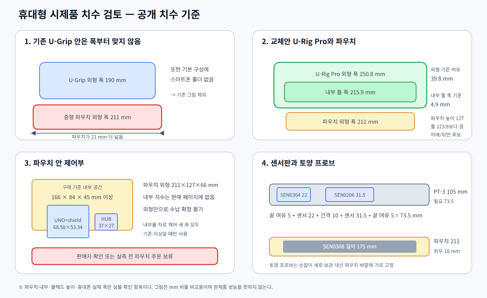
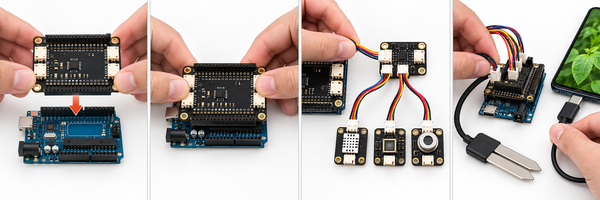
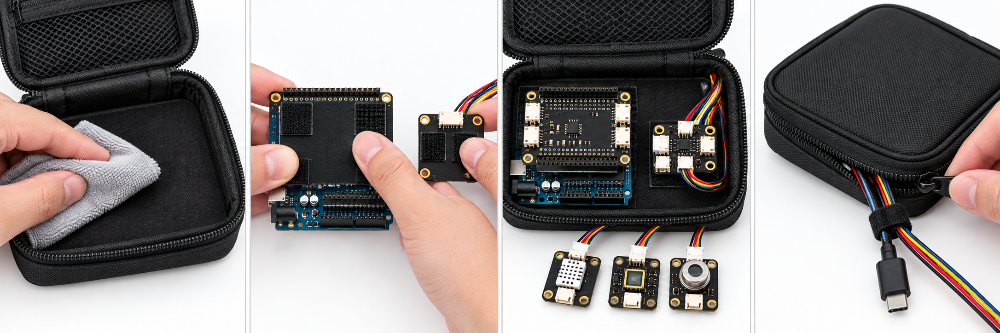
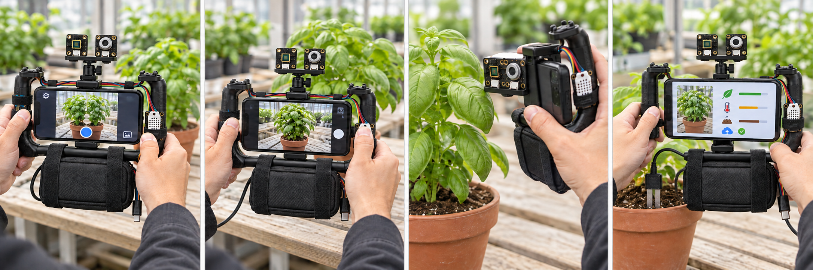

# VisionMachine 공구 없는 조립·장착 순서

이 문서는 스마트폰 클램프가 내장된 U-Rig Pro, 지퍼형 전자기기 파우치, 벨크로, 듀얼락과 손노브를 사용한 시제품 조립 순서다. 드라이버·드릴·납땜은 사용하지 않는다. 기존 생성 그림의 U-Grip 배치는 치수 검토 전 시각화이므로 구매 근거로 쓰지 않는다. **전기 연결은 반드시 모듈 인쇄와 제조사 배선도를 우선한다.**

## 1. 부품과 센서 확인

U-Rig Pro는 외형 폭 250.8 mm, 휴대폰 클램프 범위 50.8~88.9 mm다. 중형 파우치의 외형은 211×127×66 mm이며 내부 치수는 공개되지 않았다. 제어부에 필요한 내부 공간 166×84×45 mm를 판매자에게 확인하거나 실물을 잰 뒤 사용한다. 자세한 산식은 [HARDWARE_FIT_CHECK](HARDWARE_FIT_CHECK.md)에 있다.

| 센서 | 그림에서 찾는 모양 | 역할 | 최종 연결 |
|---|---|---|---|
| SEN0308 토양수분 | 케이블이 달린 긴 금속 프로브 | 화분 흙의 상대 수분값 | DFR0265의 A0/VCC/GND |
| SEN0334 온습도 | 흰 통풍부가 있는 작은 모듈 | 장치 주변 공기 온도·습도 | DFR0759 I²C 출력 1개 |
| SEN0364 AS7341 광학 | 가운데 작은 사각 감지창 | 잎·과실의 가시광 스펙트럼 특징 | DFR0759 I²C 출력 1개 |
| SEN0206 MLX90614 | 둥근 은색 금속 감지부 | 잎·과실 표면의 비접촉 온도 | DFR0759 I²C 출력 1개 |

Gravity 완성 케이블 4개, USB-C 데이터 케이블, 편조 슬리브, 벨크로 타이와 듀얼락도 확인한다. 모듈 수량이나 종류가 다르면 임의로 연결하지 않는다.

## 2. UNO·확장판·센서 연결

1. 휴대폰과 USB 케이블을 빼고 전원이 없는 상태에서 시작한다.
2. DFR0265의 양쪽 핀 소켓을 UNO의 핀 헤더 바로 위에 맞춘다. 한 칸이라도 어긋나면 누르지 않는다.
3. 양쪽을 번갈아 누르지 말고 수평을 유지해 수직으로 천천히 눌러 끝까지 장착한다.
4. DFR0265의 I²C 단자 하나와 DFR0759 입력을 Gravity 완성 케이블로 연결한다. DFR0759는 USB 허브가 아니라 I²C 선을 나누는 분배판이다.
5. DFR0759의 서로 다른 출력에 SEN0334, SEN0364, SEN0206을 하나씩 연결한다. 커넥터의 VCC/GND/SDA/SCL 순서를 양쪽에서 확인한다.
6. SEN0308은 I²C 허브에 꽂지 않는다. 제조사 케이블 기준으로 빨강은 VCC 5V, 노랑은 A0, 검정 두 가닥은 GND에 연결한다. 구매한 케이블 인쇄가 다르면 색만 보고 연결하지 않는다.
7. USB-C 케이블은 모든 센서 연결을 다시 확인한 뒤 마지막에 UNO와 휴대폰 사이에 연결한다.

세 I²C 센서는 주소가 서로 다르지만, 전원을 넣은 직후에는 센서를 하나씩 읽어 본 뒤 전체 연결로 넘어간다.

## 3. 파우치에 제어보드 수납

1. 파우치 내부를 재서 가로 166 mm, 세로 84 mm, 깊이 45 mm 이상인지 확인한다. 하나라도 작으면 조립하지 않고 교환한다. 통과하면 안쪽의 평평한 절연 칸막이와 케이블 출구 부분을 마른 천으로 닦는다. 파우치에 칸막이가 없다면 전자부품 포장에 들어 있던 평평한 절연 플라스틱판을 사용하되 금속판은 사용하지 않는다.
2. 긴 벨크로 타이 두 개를 나란히 놓고 그 위에 절연 칸막이를 올린다. UNO·DFR0265 적층 보드를 칸막이 위에 놓은 다음, 두 타이가 보드의 빈 가장자리만 지나도록 칸막이와 보드를 함께 감아 손으로 잠근다. 핀 헤더·칩·커넥터·리셋 버튼 위로 타이를 지나가게 하지 않는다.
3. DFR0759는 같은 칸막이의 빈쪽에 놓고 별도의 짧은 벨크로 한 개로 감는다. UNO 적층 보드와 손가락 한 마디 정도 여유를 두어 커넥터가 꺾이지 않게 한다.
4. 듀얼락은 PCB가 아니라 절연 칸막이 바닥과 파우치 안쪽에만 붙인다. 두 듀얼락 면을 손으로 눌러 칸막이 전체를 파우치에 고정한다.
5. SEN0334·SEN0364·SEN0206은 파우치 안에 넣지 않고 밖으로 빼 둔다. 토양수분 케이블과 USB 케이블도 같은 출구 방향으로 정리한다.
6. 지퍼는 케이블 두께만큼 8~12 mm 정도 남기고 닫는다. 케이블이 지퍼 이빨에 눌리지 않게 하고, 출구에서 2~3 cm 떨어진 곳을 벨크로 타이로 파우치 또는 그립 가로대에 묶어 당김을 막는다.

이 방식은 파우치·절연판·PCB에 구멍을 뚫지 않는다. 보드가 칸막이에서 미끄러지거나 밑면이 금속과 닿으면 전원을 넣지 않고 벨크로 위치와 절연 칸막이를 먼저 보완한다.

## 4. 휴대폰 그립과 센서 장착

1. 휴대폰 케이스 포함 폭을 재서 50.8~88.9 mm이면 U-Rig Pro 중앙 클램프에 가로로 끼운다. 후면 카메라와 USB-C 단자가 가려지지 않는지 확인한다.
2. 닫은 파우치를 중앙 촬영 공간 안에 끼우지 말고 아래 가로대의 뒤/아래에 가로로 댄다. 넓은 벨크로 타이 두 개를 서로 떨어뜨려 감고, 파우치 폭 211 mm가 그립 외형 폭 250.8 mm 안에 중앙 정렬되게 한다. 양쪽 손잡이를 잡는 공간을 확인한다.
3. 상단 콜드슈에 미니 볼헤드를 밀어 넣고 큰 손노브를 손가락으로 조인다. 공구로 과도하게 조이지 않는다.
4. PT-3 확장판을 볼헤드 위에 손으로 돌려 고정한다.
5. SEN0364와 SEN0206은 확장판 위에 나란히 고정한다. 사각 광학창과 둥근 적외선 감지부가 같은 잎이나 과실을 향해야 하며, 커넥터와 감지창을 접착재로 가리지 않는다.
6. SEN0334는 오른쪽 프레임 바깥쪽의 느슨한 벨크로 고리에 고정해 공기가 통하게 한다. 손이나 휴대폰 열이 직접 닿지 않게 한다.
7. SEN0308은 완전히 마른 상태에서 파우치 바깥 전면에 가로로 놓고 벨크로 두 개로 고정한다. 175 mm 프로브를 211 mm 파우치 중앙에 놓으면 좌우 18 mm씩 남는다. 금속 끝과 케이블 연결부가 양쪽 손잡이 밖으로 나오지 않게 한다.
8. 케이블은 그립 프레임을 따라 편조 슬리브로 한 줄로 정리한다. 손잡이, 카메라, 센서 감지부와 손노브를 가리지 않는다.

완성 후 장치를 양손으로 들어 좌우로 천천히 기울여 본다. 파우치·센서판·프로브가 움직이거나 파우치가 손가락에 닿으면 전원을 연결하지 않고 위치와 벨크로를 다시 조정한다.

## 5. 사진·잎·토양 측정 순서

1. 앱에서 검사 ID와 대상 식물을 선택하고 USB 연결 상태를 확인한다.
2. 휴대폰 후면 카메라로 식물 전체 또는 정한 잎·과실의 정지사진을 촬영한다.
3. 같은 대상에 SEN0364와 SEN0206이 함께 향하도록 센서판을 맞춘다. 잎에 닿지 않게 하고 거리·각도·조명을 기록한다. 반복성 시험 전에는 정확한 고정 거리를 임의로 확정하지 않는다.
4. 토양 측정이 필요하면 SEN0308을 파우치 바깥에서 풀어 줄기와 화분 벽에서 떨어진 정한 위치에 수직으로 삽입한다. 금속 프로브만 흙에 넣고 검은 전자부·커넥터는 흙과 물 밖에 둔다.
5. 앱에서 사진과 센서값이 같은 검사 ID로 묶였는지 확인한 뒤 서버로 전송한다. 실패 시 원본 사진과 측정값을 유지하고 재전송한다.
6. 측정이 끝나면 프로브의 흙을 마른 천으로 닦고 완전히 마른 상태에서 파우치 바깥 전면에 다시 고정한다.

## 전원을 넣기 전 최종 확인

- DFR0265가 UNO 핀에서 한 칸도 어긋나지 않았다.
- SEN0308은 A0 계열, SEN0334·SEN0364·SEN0206은 I²C 허브에 연결됐다.
- 커넥터의 VCC와 GND 방향을 모듈 인쇄로 확인했다.
- 보드 뒷면 납땜부가 금속이나 접착재에 직접 닿지 않는다.
- 케이블이 지퍼·손잡이·카메라에 눌리지 않는다.
- 파우치와 외부 센서는 물이 닿지 않는 상태다.
- 휴대폰 폭과 파우치 내부 치수가 [HARDWARE_FIT_CHECK](HARDWARE_FIT_CHECK.md)의 통과 기준을 만족한다.
- USB를 연결한 뒤 I²C scan에서 0x39, 0x44 또는 0x45, 0x5A를 확인한다.

이 그림들은 배치와 작업 순서를 보여 주는 설명 자료이며 전기 회로도나 완제품 성능 증명 자료가 아니다. 정확한 핀과 주소 근거는 [HARDWARE](HARDWARE.md)의 제조사 링크를 따른다.
